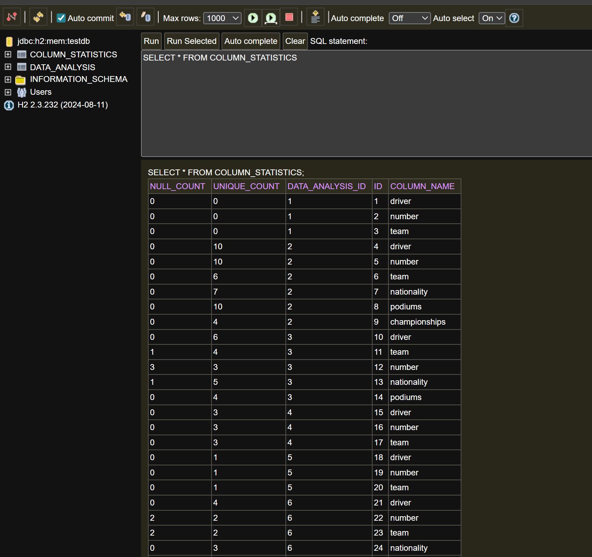

# Spring Data Analysis API

<p>Welcome to the Spring Data Analysis API. 
This project is a Spring Boot–based data analysis
REST API that ingests CSV files and automatically profiles their structure and content. 
The service extracts metadata such as column types, null counts, and statistical summaries,
then persists analysis results for later retrieval.
The system is designed to support real-world data engineering workflows, 
including dataset exploration, data quality assessment, and ETL validation before 
data is loaded into analytics platforms. It exposes clean REST endpoints for uploading data, 
retrieving analysis results, and managing stored analyses.
The focus is on production-style backend design using modern Java, clear API 
contracts, test-driven development, and extensibility for future features such 
as additional metrics, storage backends, or file formats.</p>

## Overview

This is a data analysis service built with:
- **Java 17**
- **Spring Boot 3** (Web, JPA, Actuator)
- **Gradle** for dependency management
- **H2 Database** for lightweight in-memory persistence
- **Lombok** for reducing boilerplate code
- **JUnit 5** for testing

The service provides REST API endpoints for ingesting and analyzing data, with results persisted to an H2 database.

### Real-World Use Cases

This type of service is commonly used in data engineering and analytics platforms where users need to:
- **Explore unknown datasets** - Quickly understand the structure, data types, and basic statistics of CSV files without manual inspection
- **Data quality assessment** - Automatically detect data types, identify null values, and calculate statistical summaries to assess data completeness
- **ETL pipeline validation** - Verify data format and content before loading into data warehouses or lakes
- **Self-service analytics** - Enable business users to upload and analyze their own datasets through a simple API
- **Data profiling** - Generate metadata and summary statistics for data catalogs and governance tools

In production environments, similar services often integrate with cloud storage (S3, Azure Blob), handle larger file formats (Parquet, Avro), and scale horizontally to process multiple files concurrently.

### How call the endpoints for analysis

#### Upload your txt, csv, json, excel through terminal 

-Linux
-Windows
-Mac

## If you want to contribute to the project this is how you can get started

- First clone the repo: git clone https://github.com/abdursujon/spring-data-analysis-api.git

### Build the Project
```bash
./gradlew build
```

### Run the Application
```bash
./gradlew bootRun
```
The service will start on `http://localhost:8080`

## Rerun spring when need to
```bash
./gradlew clean bootRun
```

## Stop local host before rerun if you get error on clean bootRun
- Get-NetTCPConnection -LocalPort 8080 | Select-Object -ExpandProperty OwningProcess

### Run Tests
```bash
./gradlew test
```

The test result will be printed on the terminal.
Alternatively, the result can be viewed on the browser: <your-project-path>/build/reports/tests/test/index.html

### Test the API Manually

Once the application is running, you can interact with the API using Swagger UI:

**Open in your browser:** `http://localhost:8080/swagger-ui/index.html`
This provides an interactive interface to test API endpoints without needing additional tools like Postman or curl.


## API Endpoints

### Data Analysis
- `POST /api/analysis/ingestCsv` - Ingest and analyze CSV data
- `GET /api/analysis/{id}` - Retrieve a previously analyzed CSV by ID 
- `DELETE /api/analysis/{id}` - Delete an analysis by ID

# Example test case from Windows terminal 

### For Developer Testing locally 

**File import and analysis through terminal**
- First cd into the resource directory or you can specify any directory where you have the resource to the Infile name.
- Then run this command for txt file analysis (the txt file is totally up to you change the file type to try different items).
- Allowed upload types are txt, csv (JSON, and Excel will be available soon). 

Invoke-RestMethod `
  -Uri http://104.198.32.13:8080/api/analysis/ingestCsv `
-Method POST `
  -ContentType "text/csv" `
-InFile ".\large.csv" | ConvertTo-Json

- Download the json responose analysis ( you should see the id number when u get the analysis through endpoints call)
  Invoke-WebRequest `
  -Uri "http://104.198.32.13:8080/api/analysis/1/download.json" `
  -OutFile ".\analysis.json"

## You can view the h2 console and query different commands by following below procedure
Note: This is not required, do this only if you are interested in knowing how h2 works under the hood.

First Start the Spring Boot app.

Then Open browser:
http://localhost:8080/h2-console

Login (default, you can change the properties if you like in application.yml:
JDBC URL: jdbc:h2:mem:testdb
Username: sa
Password:

Click Connect.
Run SQL for example:
SHOW TABLES;
SELECT * FROM your_table;
You should see table as shown on the image:


## Create a jar for this API 
./gradlew clean bootJar
java -jar build/libs/spring-data-analysis-api.jar
